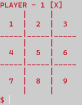

# Console Tic-Tac-Toe

## Description
This is a simple console-based Tic-Tac-Toe game implemented in C++. It allows two players to take turns and compete against each other. The players can use the keyboard to input their moves, and the game will display the board after each turn. The game will automatically detect winning combinations, draws, and inform the players when the game is over.

## Features
- ASCII art-based board visualization
- Players can take turns entering their moves
- Automatic detection of winning combinations and draw conditions
- Clear and concise command-line interface

## How to Play
1. Download the source code and compile it using your C++ compiler (e.g., g++).
2. Run the compiled executable in your command-line console.
3. The board will be displayed, and the first player (X) will be prompted to enter their move.
4. Type the number corresponding to the position where you want to place your X or O and press Enter.
5. Players take turns entering their moves until the game is over.
6. The game will automatically announce the winner or declare a draw when the game ends.
7. To start a new game, press 'n'. To quit the game, press 'q'.

## Requirements
- C++ compiler (e.g., g++)
- Windows/Linux/MacOS command-line console

## Build and Run
1. Open your command-line terminal.
2. Navigate to the directory containing the source code.
3. Compile the code using the following command (replace 'your_compiler' with your actual compiler):
